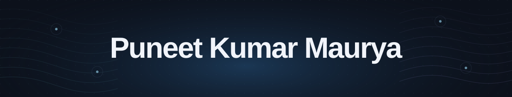
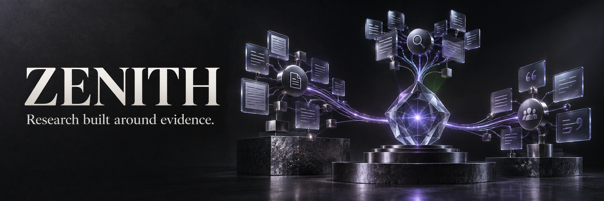
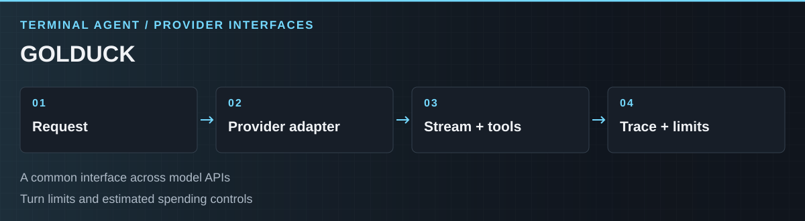
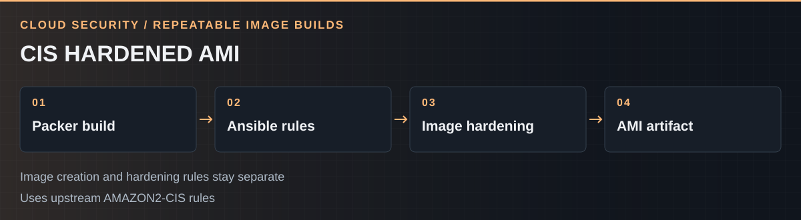
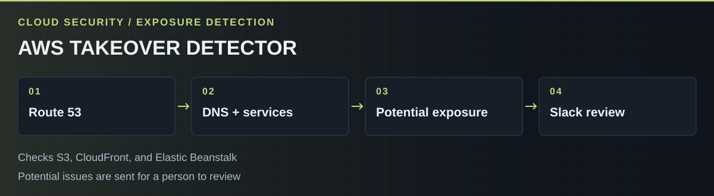

<h1 align="center">
<picture>
  <source media="(max-width: 600px)" srcset="assets/v4/nameplate-mobile.svg">
  
</picture>
</h1>

<strong>Staff Cloud Security Engineer at Twilio</strong> AI Security &nbsp; · &nbsp; Agentic Vulnerability Research

<a href="#featured-projects">Featured projects</a> &nbsp; · &nbsp; <a href="#more-builds">More builds</a> &nbsp; · &nbsp; <a href="#experience">Experience</a> &nbsp; · &nbsp; <a href="https://www.linkedin.com/in/pkmdev">LinkedIn ↗</a>

I build tools for finding security risks and making agent workflows easier to inspect. My public work spans secret scanning, persistent memory, research orchestration, and cloud security automation.

## Featured projects

### [01 / Morphex](https://github.com/pkmdev-sec/morphex.sh)

**A finding should explain why it needs attention.** Morphex is a Go secret scanner that examines variable names, value shape, file context, and surrounding code.

The interesting part is what travels with the result: classification signals and reasoning that a reviewer can inspect. Context is part of the finding, rather than something the reviewer has to reconstruct from a matched string.

[Explore the code ↗](https://github.com/pkmdev-sec/morphex.sh) &nbsp; · &nbsp; [Project site & illustrative demo ↗](https://www.morphex.sh/)

---

### [02 / Engram](https://github.com/pkmdev-sec/engram)

**Keep useful context as the codebase changes.** Engram carries project knowledge between coding sessions, with checks against referenced files and Git history before reuse.

Memory lives in inspectable JSONL. Warnings and background context have separate limits, making the choice about what enters a session explicit. The focus is useful, reviewable context rather than an ever-growing transcript.

[Explore the code ↗](https://github.com/pkmdev-sec/engram)

---

### [03 / Zenith](https://github.com/pkmdev-sec/zenith)

**Research needs a trail from the claim back to its source.** Zenith is a terminal research workflow where agents can support, challenge, or qualify earlier claims.

Claims and sources form a shared structure, with explicit review and delivery steps. Built on Pi and inspired by [MiroFish](https://github.com/666ghj/MiroFish).

[Explore the code ↗](https://github.com/pkmdev-sec/zenith)

## More builds

### [04 / Golduck](https://github.com/pkmdev-sec/golduck)

<picture>
  <source media="(max-width: 600px)" srcset="assets/v3/golduck-mobile.svg">
  
</picture>

A terminal agent with streaming responses, tool use, and adapters for different model APIs. A shared provider interface keeps integration choices separate from the agent loop. Run traces, turn limits, and controls on estimated spending make execution easier to inspect.

### [05 / CIS Hardened AMI](https://github.com/pkmdev-sec/CIS-Hardened-AMI)

<picture>
  <source media="(max-width: 600px)" srcset="assets/v3/cis-mobile.svg">
  
</picture>

A repeatable image-building pipeline combining Packer with upstream Ansible hardening rules. Image creation and security rules stay separate so each can evolve independently. Earlier work from 2023, built with a collaborator credited in the repository.

### [06 / AWS Subdomain Takeover Detector](https://github.com/pkmdev-sec/AWS_Subdomain_Takeover_Detector)

<picture>
  <source media="(max-width: 600px)" srcset="assets/v3/aws-mobile.svg">
  
</picture>

Checks Route 53 records for potential takeover exposure, combining DNS checks with checks for S3, CloudFront, and Elastic Beanstalk. Potential issues go to Slack for review. Earlier cloud security work from 2021.

### The wider workbench

- **[Pi Evolver](https://github.com/pkmdev-sec/pi-evolver)** — Learns from session counts, outcomes, and recurring error signatures. An explicit command turns a pattern into a draft skill for a person to complete and review.
- **[AWS policy exposure alerts](https://github.com/pkmdev-sec/Detect-Public-AWS-resources-misconfigured-via-Policy-Realtime)** — Checks policy-change events for potential public access and includes the policy in Slack alerts. Earlier work from 2021.
- **[Cloudflare WAF alerting](https://github.com/pkmdev-sec/Cloudflare_waf_alerting)** — Groups blocked requests by IP and alerts when a count threshold is crossed. Earlier work from 2021.
- **[Claude Max Context](https://github.com/pkmdev-sec/claude-max-context)** — Session handoff and compaction hooks, with configuration backups and an uninstall path. Compatibility depends on the Claude Code version.
- **[CocoIndex Claude Code](https://github.com/pkmdev-sec/cocoindex-claude-code)** — Document search through MCP, using CocoIndex, hosted embeddings, and PostgreSQL with pgvector. Indexing and search share an embedding function.
- **[OpenClaw Memory](https://github.com/pkmdev-sec/openclaw-mem)** — Agent memory using LanceDB and local models through Ollama, with backup and restore tooling.
- **[Skylily Pulsed](https://github.com/pkmdev-sec/skylily-pulsed)** — A Rust service for system metrics, Docker state, network data, and service health. Separate collectors sit behind an HTTP API.
- **[Skylily Code Router](https://github.com/pkmdev-sec/skylily-code-router)** — Routes tasks to installed coding agents. Recommendations can be inspected before execution.

[Browse all public repositories ↗](https://github.com/pkmdev-sec?tab=repositories)

## Current research

I’m currently focused on **AI security**, building an **agentic security harness** to investigate vulnerabilities in our systems, including potential zero-days. The goal is repeatable security research with findings that people can examine and validate. This work is private.

Across my public projects, a recurring concern is what another engineer needs to see to trust a result: the reasoning behind a finding, the source behind a claim, or the context behind an agent’s action.

## Experience

My background spans **cloud security, DevSecOps, and application security**. That work informs how I approach AI security today: understand the trust boundaries, build controls into engineering workflows, and keep the evidence behind a decision.

**Twilio — Staff Cloud Security Engineer**  
Current role, focused on AI security and agentic security harnesses for vulnerability research.

**HelloBetter — Senior DevSecOps Engineer**  
Architected cloud infrastructure serving 200K+ healthcare users. Built CI/CD pipelines with static and dynamic security testing across 25+ microservices, alongside Kubernetes security controls across 15+ clusters.

**Zepto — Lead Security Engineer**  
Established a DevSecOps maturity model and integrated security testing into delivery. Worked on PCI DSS Level 1 compliance through automated controls and monitoring. Ran 25+ risk assessments and threat-modeling sessions, with Terraform automation managing 500+ cloud resources.

**Atlan — Senior Security Engineer**  
Built an AMI hardening pipeline using immutable infrastructure and CIS benchmarks. Automated container compliance monitoring and security controls supporting SOC 2 Type II and GDPR audits.

**Dream11 — Application Security Engineer**  
Worked across penetration testing, WAF protection, and security monitoring. Validated 40+ penetration tests using OWASP methods, identifying 200+ security issues. Built SIEM and incident-response automation.

<strong>Working toolkit</strong>

**Cloud & platforms** — AWS · GCP · Azure · Kubernetes · Docker  
**Infrastructure & delivery** — Terraform · CloudFormation · Packer · Ansible · Helm · Argo CD · GitHub Actions · Jenkins · GitLab CI/CD  
**Security & operations** — SAST/DAST · OWASP methods · WAF · SIEM · CIS benchmarks · Prometheus · Grafana · ELK · Splunk  
**Code** — Python · Go · JavaScript / TypeScript · Node.js · Bash · SQL

<a href="https://www.linkedin.com/in/pkmdev">Connect on LinkedIn ↗</a>

