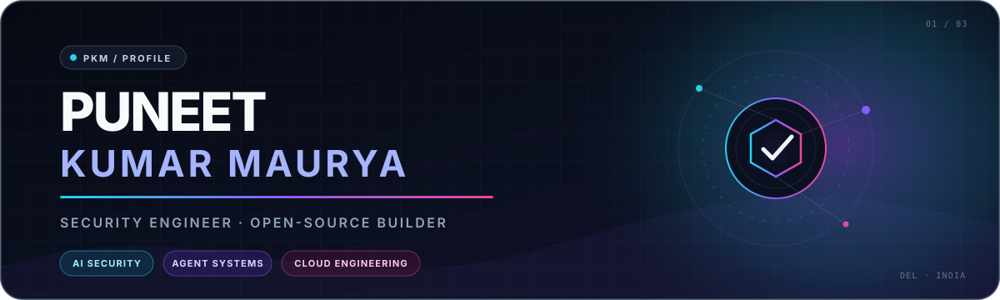

  <picture>
    <source media="(max-width: 600px)" srcset="assets/profile-hero-mobile.svg">
    
  </picture>

<h1 align="center">Hi, I'm Puneet 👋</h1>

  📍 <strong>Delhi</strong> &nbsp;·&nbsp; 🛡️ <strong>Staff Cloud Security Engineer at Twilio</strong> &nbsp;·&nbsp; 🤖 <strong>AI security builder</strong>

  I build security tools and agent systems. I make their results clear, useful, and easy to check.

  <a href="#selected-work">Selected work</a> &nbsp;·&nbsp;
  <a href="#build-history">Build history</a> &nbsp;·&nbsp;
  <a href="#current-focus">Current focus</a> &nbsp;·&nbsp;
  <a href="#career">Career</a> &nbsp;·&nbsp;
  <a href="#connect">Connect</a>

## Selected Work

Nine projects show the main ideas behind my work: clear evidence, controlled agents, and secure cloud systems.

<table>
<tr>
<td width="50%" valign="top">

### 01 · 🔍 [Morphex](https://github.com/pkmdev-sec/morphex.sh)

`GO` `SECRET SCANNING`

Reads code context before it reports a secret. Each result explains why it needs attention.

</td>
<td width="50%" valign="top">

### 02 · ◈ [Orvek](https://github.com/pkmdev-sec/orvek)

`RUST` `CODING AGENT`

A native terminal agent with local tools, resumable sessions, shared memory, and context compaction.

</td>
</tr>
<tr>
<td width="50%" valign="top">

### 03 · 👁️ [Veyro](https://github.com/pkmdev-sec/veyro)

`PYTHON` `LOCAL SUPERVISION`

Observes coding-agent sessions and uses explicit approvals before control actions.

</td>
<td width="50%" valign="top">

### 04 · 📦 [Agent Sandbox Orchestrator](https://github.com/pkmdev-sec/agents-sandboxing)

`GO` `ISOLATION`

Runs Claude Code jobs in containers with resource limits, timeouts, and stored results.

</td>
</tr>
<tr>
<td width="50%" valign="top">

### 05 · ⚙️ [Praxis Engine](https://github.com/pkmdev-sec/praxis-engine)

`RUST` `KNOWLEDGE RETRIEVAL`

Compresses reusable agent knowledge and retrieves only the parts that match the task.

</td>
<td width="50%" valign="top">

### 06 · 🧱 [CIS Hardened AMI](https://github.com/pkmdev-sec/CIS-Hardened-AMI)

`PACKER` `ANSIBLE` `CLOUD HARDENING`

Builds repeatable cloud images from CIS Level 1 and Level 2 hardening rules.

</td>
</tr>
<tr>
<td width="50%" valign="top">

### 07 · 🌩️ [AWS Subdomain Takeover Detector](https://github.com/pkmdev-sec/AWS_Subdomain_Takeover_Detector)

`PYTHON` `AWS SECURITY`

Checks Route 53 records and connected AWS services for possible subdomain takeover.

</td>
<td width="50%" valign="top">

### 08 · 🌲 [Arbor](https://github.com/pkmdev-sec/Arbor)

`JAVASCRIPT` `MULTI-AGENT`

Runs Claude Code agents in separate Git worktrees and merges their completed work.

</td>
</tr>
<tr>
<td width="50%" valign="top">

### 09 · ✦ [Zenith](https://github.com/pkmdev-sec/zenith)

`TYPESCRIPT` `RESEARCH`

A terminal research workflow that connects claims to sources and review steps.

</td>
<td width="50%" valign="top">

### ↗ [Explore the full workbench](https://github.com/pkmdev-sec?tab=repositories)

`OPEN SOURCE` `EXPERIMENTS`

Browse the complete archive of public tools, prototypes, and supporting packages.

</td>
</tr>
</table>

## Build History

Every day is a green dot. Brighter, larger dots mark real contribution days.

<picture>
  <source media="(max-width: 600px)" srcset="assets/build-history-mobile.svg">
  
</picture>

## Current Focus

- **AI security** — I build repeatable ways to test agent systems and investigate vulnerabilities.
- **Agent tools** — I build coding agents, context systems, and reviewable workflows.
- **Open source** — I turn recurring engineering problems into tools that other people can inspect.
- **Cloud security** — I apply lessons from cloud and application security to AI systems.

## Career

- **Twilio — Staff Cloud Security Engineer** — I focus on AI security and agent security research.
- **HelloBetter — Senior DevSecOps Engineer** — I designed cloud infrastructure, delivery pipelines, and Kubernetes security controls.
- **Zepto — Lead Security Engineer** — I built security testing, compliance controls, and threat-modeling practices.
- **Atlan — Senior Security Engineer** — I built image hardening and container compliance automation.
- **Dream11 — Application Security Engineer** — I worked on application testing, WAF protection, monitoring, and incident response.

<strong>Working toolkit</strong>

 

**Cloud and platforms** — AWS · GCP · Azure · Kubernetes · Docker 
**Infrastructure and delivery** — Terraform · CloudFormation · Packer · Ansible · Helm · Argo CD · GitHub Actions 
**Security and operations** — SAST · DAST · OWASP · WAF · SIEM · CIS benchmarks · Prometheus · Grafana 
**Code** — Python · Go · Rust · TypeScript · JavaScript · Bash · SQL

## Connect

[LinkedIn ↗](https://www.linkedin.com/in/pkmdev) &nbsp;·&nbsp; [X / @punitmau ↗](https://x.com/punitmau) &nbsp;·&nbsp; [GitHub ↗](https://github.com/pkmdev-sec)

---

### Working Principle

> **Make the result easy to trust.** 
> Security tools should show context. Research should show sources. Agent workflows should leave a clear trail.
