# [Puneet](https://www.linkedin.com/in/pkmdev)

Security engineer building tools for cloud security and AI agents.

[Selected projects](#selected-projects) · [Agent tools](#agent-systems-and-developer-tools) · [Security](#security-and-cloud-engineering) · [Apps](#apps-and-interfaces) · [AI utilities](#ai-tools-and-utilities) · [Background](#background)

## Selected projects

<table>
<tbody>
<tr><td width="64" align="center" valign="top">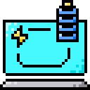</td><td valign="top"><a href="https://github.com/pkmdev-sec/orvek"><strong>Orvek</strong></a> Terminal coding agent with local tools, saved sessions, and configurable model providers.</td></tr>
<tr><td width="64" align="center" valign="top"></td><td valign="top"><a href="https://github.com/pkmdev-sec/Arbor"><strong>Arbor</strong></a> Runs Claude Code workers in parallel, each in a separate Git worktree.</td></tr>
<tr><td width="64" align="center" valign="top"></td><td valign="top"><a href="https://github.com/pkmdev-sec/morphex.sh"><strong>Morphex</strong></a> Scans for secrets using variable names, file types, and surrounding code.</td></tr>
<tr><td width="64" align="center" valign="top"></td><td valign="top"><a href="https://github.com/pkmdev-sec/veyro"><strong>Veyro</strong></a> Reviews coding-agent sessions locally. Supported control actions require approval.</td></tr>
<tr><td width="64" align="center" valign="top">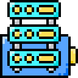</td><td valign="top"><a href="https://github.com/pkmdev-sec/agents-sandboxing"><strong>Agent Sandbox Orchestrator</strong></a> Runs Claude Code jobs in isolated containers.</td></tr>
<tr><td width="64" align="center" valign="top">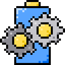</td><td valign="top"><a href="https://github.com/pkmdev-sec/praxis-engine"><strong>Praxis Engine</strong></a> Rust engine for compressing and retrieving agent knowledge.</td></tr>
<tr><td width="64" align="center" valign="top">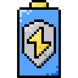</td><td valign="top"><a href="https://github.com/pkmdev-sec/CIS-Hardened-AMI"><strong>CIS Hardened AMI</strong></a> Builds cloud images using CIS hardening rules.</td></tr>
<tr><td width="64" align="center" valign="top"></td><td valign="top"><a href="https://github.com/pkmdev-sec/AWS_Subdomain_Takeover_Detector"><strong>AWS Subdomain Takeover Detector</strong></a> Checks AWS DNS records for possible subdomain takeover.</td></tr>
<tr><td width="64" align="center" valign="top"></td><td valign="top"><a href="https://github.com/pkmdev-sec/zenith"><strong>Zenith</strong></a> Terminal research agent that connects claims to sources and review steps.</td></tr>
</tbody>
</table>

## Agent systems and developer tools

<table>
<tbody>
<tr><td width="64" align="center" valign="top"></td><td valign="top"><a href="https://github.com/pkmdev-sec/sigil"><strong>Sigil</strong></a> Prompt engineering tools for Claude Code.</td></tr>
<tr><td width="64" align="center" valign="top">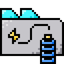</td><td valign="top"><a href="https://github.com/pkmdev-sec/openclaw-mem"><strong>OpenClaw Memory</strong></a> Stores and searches agent memory, with optional device sync.</td></tr>
<tr><td width="64" align="center" valign="top"></td><td valign="top"><a href="https://github.com/pkmdev-sec/praxis"><strong>Praxis</strong></a> Assigns reasoning budgets by task complexity and tracks cost.</td></tr>
<tr><td width="64" align="center" valign="top"></td><td valign="top"><a href="https://github.com/pkmdev-sec/revolutionary-ai-orchestrator"><strong>AI Orchestrator</strong></a> Runs isolated AI workers in tmux.</td></tr>
<tr><td width="64" align="center" valign="top"></td><td valign="top"><a href="https://github.com/pkmdev-sec/rust-ai-gateway"><strong>Rust AI Gateway</strong></a> Routes AI API requests through a gateway written in Rust.</td></tr>
<tr><td width="64" align="center" valign="top">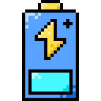</td><td valign="top"><a href="https://github.com/pkmdev-sec/claude-intelligence-setup"><strong>Claude Intelligence Setup</strong></a> Adds hooks, agents, and a learning loop to Claude Code.</td></tr>
<tr><td width="64" align="center" valign="top"></td><td valign="top"><a href="https://github.com/pkmdev-sec/forge"><strong>Forge</strong></a> Creates tools from YAML definitions and serves them through MCP.</td></tr>
<tr><td width="64" align="center" valign="top">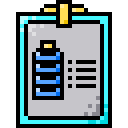</td><td valign="top"><a href="https://github.com/pkmdev-sec/echo"><strong>Echo</strong></a> Records agent sessions and shows usage analytics.</td></tr>
<tr><td width="64" align="center" valign="top"></td><td valign="top"><a href="https://github.com/pkmdev-sec/chimera"><strong>Chimera</strong></a> Routes requests across model providers and handles failover.</td></tr>
<tr><td width="64" align="center" valign="top"></td><td valign="top"><a href="https://github.com/pkmdev-sec/umwelt"><strong>Umwelt</strong></a> Describes the working environment for AI-assisted development.</td></tr>
<tr><td width="64" align="center" valign="top"></td><td valign="top"><a href="https://github.com/pkmdev-sec/nexus"><strong>Nexus</strong></a> Stores context across sessions in a knowledge graph.</td></tr>
<tr><td width="64" align="center" valign="top"></td><td valign="top"><a href="https://github.com/pkmdev-sec/hydra"><strong>Hydra</strong></a> Runs several models and compares their quality and cost.</td></tr>
<tr><td width="64" align="center" valign="top"></td><td valign="top"><a href="https://github.com/pkmdev-sec/oracle"><strong>Oracle</strong></a> Predicts and loads files that may matter to the next task.</td></tr>
<tr><td width="64" align="center" valign="top"></td><td valign="top"><a href="https://github.com/pkmdev-sec/pi-evolver"><strong>Pi Evolver</strong></a> Learns from Pi sessions and proposes skills for review.</td></tr>
<tr><td width="64" align="center" valign="top">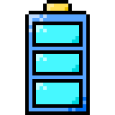</td><td valign="top"><a href="https://github.com/pkmdev-sec/claude-max-context"><strong>Claude Max Context</strong></a> Tunes compaction and preserves state during Claude Code sessions.</td></tr>
<tr><td width="64" align="center" valign="top"></td><td valign="top"><a href="https://github.com/pkmdev-sec/golduck"><strong>Golduck</strong></a> Terminal coding agent that works with multiple model providers.</td></tr>
<tr><td width="64" align="center" valign="top"></td><td valign="top"><a href="https://github.com/pkmdev-sec/engram"><strong>Engram</strong></a> Brings knowledge from past agent sessions into new work.</td></tr>
<tr><td width="64" align="center" valign="top">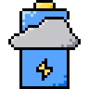</td><td valign="top"><a href="https://github.com/pkmdev-sec/cocoindex-claude-code"><strong>CocoIndex for Claude Code</strong></a> Adds semantic document search to Claude Code through MCP.</td></tr>
<tr><td width="64" align="center" valign="top"></td><td valign="top"><a href="https://github.com/pkmdev-sec/claude-auto-documenter-v2"><strong>Claude Auto Documenter</strong></a> Generates project documentation through an MCP server.</td></tr>
</tbody>
</table>

## Security and cloud engineering

<table>
<tbody>
<tr><td width="64" align="center" valign="top"></td><td valign="top"><a href="https://github.com/pkmdev-sec/warden"><strong>Warden</strong></a> Enforces policies and records an audit trail.</td></tr>
<tr><td width="64" align="center" valign="top"></td><td valign="top"><a href="https://github.com/pkmdev-sec/specter"><strong>Specter</strong></a> Checks syntax, security, and agent output quality.</td></tr>
<tr><td width="64" align="center" valign="top">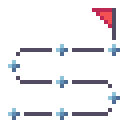</td><td valign="top"><a href="https://github.com/pkmdev-sec/web3-blockchain-learning-curriculum"><strong>Web3 Security Curriculum</strong></a> A learning path for Web3 and blockchain security.</td></tr>
<tr><td width="64" align="center" valign="top">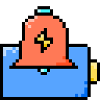</td><td valign="top"><a href="https://github.com/pkmdev-sec/Cloudflare_waf_alerting"><strong>Cloudflare WAF Alerts</strong></a> Sends alerts for Cloudflare WAF events.</td></tr>
<tr><td width="64" align="center" valign="top"></td><td valign="top"><a href="https://github.com/pkmdev-sec/Detect-Public-AWS-resources-misconfigured-via-Policy-Realtime"><strong>AWS Policy Exposure Detector</strong></a> Detects AWS policy changes that can expose resources.</td></tr>
<tr><td width="64" align="center" valign="top"></td><td valign="top"><a href="https://github.com/pkmdev-sec/Detecting_Elastic_IP_Takeover_Realtime"><strong>Elastic IP Takeover Detector</strong></a> Detects exposed Elastic IP configurations.</td></tr>
<tr><td width="64" align="center" valign="top"></td><td valign="top"><a href="https://github.com/pkmdev-sec/AWS_Waf-Automation"><strong>AWS WAF Automation</strong></a> Scripts for automating AWS WAF controls.</td></tr>
<tr><td width="64" align="center" valign="top"></td><td valign="top"><a href="https://github.com/pkmdev-sec/AWS_Cloud_Security_Automations"><strong>AWS Cloud Security Automations</strong></a> A collection of AWS security automation scripts.</td></tr>
<tr><td width="64" align="center" valign="top">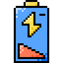</td><td valign="top"><a href="https://github.com/pkmdev-sec/R53-Orphaned-Entries-Detection"><strong>Route 53 Orphaned Entries</strong></a> Finds orphaned Route 53 records in an AWS account.</td></tr>
<tr><td width="64" align="center" valign="top"></td><td valign="top"><a href="https://github.com/pkmdev-sec/Reatime_S3_Public_Bucket-Object_Alerts"><strong>S3 Public Access Alerts</strong></a> Sends Slack alerts when S3 buckets or objects become public.</td></tr>
</tbody>
</table>

## Apps and interfaces

<table>
<tbody>
<tr><td width="64" align="center" valign="top"></td><td valign="top"><a href="https://github.com/pkmdev-sec/MarklyAI"><strong>MarklyAI</strong></a> AI-assisted bookmark manager for macOS.</td></tr>
<tr><td width="64" align="center" valign="top"></td><td valign="top"><a href="https://github.com/pkmdev-sec/muxy"><strong>Muxy</strong></a> Public fork of a lightweight terminal built with SwiftUI.</td></tr>
<tr><td width="64" align="center" valign="top">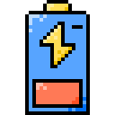</td><td valign="top"><a href="https://github.com/pkmdev-sec/purewin"><strong>PureWin</strong></a> Tools for Windows cleanup and optimization.</td></tr>
</tbody>
</table>

## AI tools and utilities

<table>
<tbody>
<tr><td width="64" align="center" valign="top">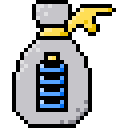</td><td valign="top"><a href="https://github.com/pkmdev-sec/skylily-cost-tracker"><strong>AI Cost Tracker</strong></a> Tracks and reviews LLM API costs.</td></tr>
<tr><td width="64" align="center" valign="top"></td><td valign="top"><a href="https://github.com/pkmdev-sec/skylily-smart-router"><strong>AI Smart Router</strong></a> Routes tasks to models based on complexity.</td></tr>
<tr><td width="64" align="center" valign="top"></td><td valign="top"><a href="https://github.com/pkmdev-sec/skylily-doc-gen"><strong>AI Doc Gen</strong></a> Generates documentation from a codebase.</td></tr>
<tr><td width="64" align="center" valign="top"></td><td valign="top"><a href="https://github.com/pkmdev-sec/skylily-git-smart"><strong>AI Git Smart</strong></a> Helps write commits, changelogs, and pull request descriptions.</td></tr>
<tr><td width="64" align="center" valign="top">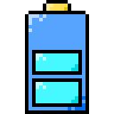</td><td valign="top"><a href="https://github.com/pkmdev-sec/skylily-llm-proxy"><strong>AI LLM Proxy</strong></a> Proxies LLM API requests.</td></tr>
<tr><td width="64" align="center" valign="top"></td><td valign="top"><a href="https://github.com/pkmdev-sec/skylily-code-router"><strong>AI Code Router</strong></a> Routes tasks to installed coding agents.</td></tr>
<tr><td width="64" align="center" valign="top"></td><td valign="top"><a href="https://github.com/pkmdev-sec/skylily-skill"><strong>Agentic Skill</strong></a> Shell tools for Skylily skills.</td></tr>
</tbody>
</table>

[Browse all repositories](https://github.com/pkmdev-sec?tab=repositories)

## Background

Staff Cloud Security Engineer at Twilio, based in Delhi. My work covers cloud security, application security, and AI agent systems.

Previously worked in security engineering at HelloBetter, Zepto, Atlan, and Dream11.

## Connect

[Website](https://pkmdev.com) · [LinkedIn](https://www.linkedin.com/in/pkmdev) · [X](https://x.com/punitmau)

Pixel icons by [Dooder](https://www.flaticon.com/authors/dooder), [itdscctv](https://www.flaticon.com/authors/itdscctv), and [Magnific](https://www.flaticon.com/authors/magnific) on [Flaticon](https://www.flaticon.com/). [Icon credits](assets/icons/CREDITS.md).
